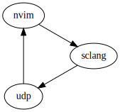

# Project overview

*scnvim* is a Neovim editor frontend for SuperCollider. It is composed part as a Neovim plugin and part as a collection of SuperCollider classes.

## Files

Here is an overview of the project (note that some files might have moved or been deleted since document was generated). As a general remark, much the functionality in the `autoload` directory will probably move to `lua`.

```text
.
├── autoload
│   ├── health                       # health checks
│   │   └── scnvim.vim
│   ├── scnvim
│   │   ├── document.vim             # document support
│   │   ├── help.vim                 # integrated help system
│   │   ├── postwindow.vim           # functions related to the post window
│   │   ├── sclang.vim               # sclang process communication
│   │   ├── statusline.vim           # widgets to use in the status line
│   │   └── util.vim                 # various utilities
│   └── scnvim.vim
├── doc
│   └── SCNvim.txt                   # nvim documentation (:help scnvim)
├── ftdetect
│   └── supercollider.vim            # file type detection for .scd and .sc file extensions 
├── ftplugin
│   ├── scnvim.vim                   # settings for the post window buffer
│   └── supercollider
│       ├── commands.vim             # commands
│       ├── mappings.vim             # mappings
│       └── supercollider.vim        # general settings for SuperCollider buffers
├── indent
│   └── supercollider.vim            # indentation
├── lua
│   ├── scnvim
│   │   ├── help.lua                 # integrated help system
│   │   ├── install.lua              # cross platform installation module
│   │   ├── udp.lua                  # IPC sclang -> nvim
│   │   └── utils.lua                # various utilities
│   └── scnvim.lua                   # main module interface
├── plugin
│   └── supercollider.vim            # globals
├── scide_scnvim
│   ├── Classes
│   │   ├── Document.sc              # document support
│   │   ├── SCNvim.sc                # main interface
│   │   ├── SCNvimDoc
│   │   │   ├── SCNvimDoc.sc         # scdoc overrides
│   │   │   ├── SCNvimDocRenderer.sc # scdoc renderer (for vim help file output)
│   │   │   └── extSCNvim.sc         # help system related function
│   │   └── SCNvimJSON.sc            # json serializer/deserialzer
│   └── HelpSource
│       └── Classes
│           └── SCNvim.schelp        # scdoc documentation
└── syntax
    └── supercollider.vim            # syntax highlighting
```

## IPC model

The inter-process communication between `sclang` and `nvim` consists of JSON messages delivered over UDP. On the nvim side there is a local UDP server (`lua/scnvim/udp.lua`) and on the SuperCollider side there is the `SCNvim.sendJSON(data)` class method.

Here is a small diagram that explains the setup. Note both the UDP server and `sclang` process are owned by `nvim.`



### Sending data `sclang -> nvim`

`SCNvim.sendJSON` accepts a single `data` argument which should be an instance `IdentityDictionary` with the following keys:

```supercollider
(action: "someAction", args: 777);
```

The `action` key defines what action `scnvim` will take in response to the message, and the `args` key provides optional data needed to complete the action. Note that new keys might be added in the future. Take a look in [`lua/scnvim.lua`](https://github.com/davidgranstrom/scnvim/blob/master/lua/scnvim.lua) to see which actions are supported at the moment.

### Sending data `nvim -> sclang`

Sending sclang statements from nvim can be done by using the `viml` API and `lua` functions. Note that the following listed functions are asynchronous.

* viml
  - `scnvim#sclang#send(msg)`
  - `scnvim#sclang#send_silent(msg)`

* lua
  - `require('scnvim').send(msg)`

**Sending and receving data**

By using `require('scnvim').eval(msg, callback)` we can get synchronous results back from sclang.

```lua
local scnvim = require('scnvim')
scnvim.eval('1 + 1', function(res)
  print(res) -- the result is passed from sc via this callback
end)
```
